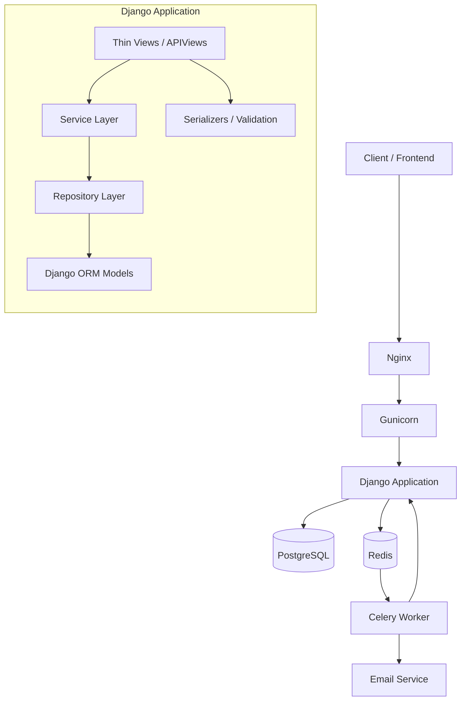

```markdown
<!--
  ╔══════════════════════════════════════════════════════════════╗
  ║   NexCart — Production‑grade Backend E‑Commerce API         ║
  ║   Clean Architecture · Service Layer · Repository Pattern   ║
  ╚══════════════════════════════════════════════════════════════╝
-->

<div align="center">

# 🛒 NexCart

**Scalable, production‑ready REST API for e‑commerce**  
*Built with Django REST Framework using Clean Architecture and Service Layer principles*

[](https://www.python.org/)
[](https://www.djangoproject.com/)
[](https://www.django-rest-framework.org/)
[](https://www.postgresql.org/)
[](https://www.docker.com/)
[](https://github.com/your-username/nexcart)
[](https://github.com/your-username/nexcart/actions)
[](LICENSE)

</div>

---

## 📑 Table of Contents

- [Project Overview](#-project-overview)
- [Architecture](#-architecture)
- [Folder Structure](#-folder-structure)
- [Technology Stack](#-technology-stack)
- [Features](#-features)
- [API Overview](#-api-overview)
- [Authentication Flow](#-authentication-flow)
- [Database Design Overview](#-database-design-overview)
- [Installation](#-installation)
- [Local Development](#-local-development)
- [Docker](#-docker)
- [Environment Variables](#-environment-variables)
- [Running Tests](#-running-tests)
- [Swagger Documentation](#-swagger-documentation)
- [CI/CD Pipeline](#-cicd-pipeline)
- [Deployment](#-deployment)
- [Security Features](#-security-features)
- [Performance Considerations](#-performance-considerations)
- [Design Patterns Used](#-design-patterns-used)
- [Project Statistics](#-project-statistics)
- [Roadmap](#-roadmap)
- [Future Improvements](#-future-improvements)
- [Contributing](#-contributing)
- [License](#-license)
- [Author](#-author)

---

## 🧠 Project Overview

NexCart is a **backend‑only** e‑commerce platform designed to serve any frontend (mobile, web, PWA) through a versioned REST API. The codebase follows **Clean Architecture** with a strict **Service Layer** and **Repository Pattern** – every business rule lives in services, and data access is abstracted behind repositories. Views are kept thin, serializers handle validation, and the domain logic is completely decoupled from the framework.

> **Why NexCart?**  
> Most Django e‑commerce projects mix business logic with views or models, making them hard to test, maintain, or extend. NexCart demonstrates how a real‑world backend can be built with the same architectural rigour you’d expect from a Senior Backend Engineer – fully tested, dockerised, and ready for production.

The repository contains **no frontend code** – only the API and its supporting infrastructure (Celery, Redis, PostgreSQL, Nginx, etc.).

---

## 🏗 Architecture

NexCart enforces a clear separation of concerns. The dependency rule points inward: controllers (views) depend on services, services depend on repositories, and repositories depend on models. External integrations (payments, email) are abstracted behind interfaces.



- **Views**: only handle HTTP concerns (request parsing, response rendering).
- **Services**: contain **all business logic** (checkout, stock management, coupon application).
- **Repositories**: encapsulate ORM queries, provide a test‑friendly data access layer.
- **Models**: pure Django ORM, no business logic.

Cross‑cutting concerns (permissions, throttling, logging) are implemented via DRF’s built‑in mechanisms and custom middleware.

---

## 📁 Folder Structure

<details>
<summary><strong>Click to expand full project tree</strong></summary>

```
nexcart/
├── accounts/           # Custom User, JWT auth, roles
│   ├── models.py
│   ├── repositories.py
│   ├── services.py
│   ├── serializers.py
│   ├── views.py
│   ├── urls.py
│   ├── admin.py
│   └── tests/
├── common/             # Shared utilities, base classes
├── core/               # Project configuration (settings, urls, wsgi)
│   ├── settings/
│   ├── urls.py
│   └── wsgi.py
├── categories/         # Category tree (nested categories)
│   ├── models.py
│   ├── repositories.py
│   ├── services.py
│   ├── serializers.py
│   ├── views.py
│   ├── urls.py
│   ├── admin.py
│   └── tests/
├── brands/             # Product brands
├── products/           # Products, images, inventory, discounts
├── reviews/            # Ratings, comments, moderation
├── cart/               # Anonymous/authenticated cart, merge, coupons
├── wishlist/           # User wishlist
├── orders/             # Checkout, order lifecycle, atomic transactions
├── payments/           # Gateway abstraction (Strategy pattern)
├── notifications/      # Celery tasks for emails
├── templates/          # Email templates
├── docker/             # Docker & Nginx configs
├── .github/            # CI/CD workflows
├── manage.py
├── requirements.txt
├── Dockerfile
├── docker-compose.yml
├── .env.example
├── pyproject.toml      # Black, Ruff, isort config
└── README.md
```
</details>

Every app follows the **same internal structure**: `models.py` → `repositories.py` → `services.py` → `serializers.py` → `views.py` → `urls.py` – making the codebase predictable and easy to navigate.

---

## 🧰 Technology Stack

| Category              | Technology / Tool                                      |
|-----------------------|--------------------------------------------------------|
| **Backend Framework** | Django 5.0, Django REST Framework 3.15                 |
| **Language**          | Python 3.13                                            |
| **Database**          | PostgreSQL 16 (production), SQLite (development)       |
| **Caching / Broker**  | Redis 7                                                |
| **Task Queue**        | Celery 5.4                                             |
| **Authentication**    | JWT (simplejwt) with refresh tokens & blacklist        |
| **API Documentation** | drf‑spectacular (OpenAPI 3 / Swagger)                  |
| **Web Server**        | Gunicorn + Nginx                                       |
| **Containerization**  | Docker, Docker Compose                                 |
| **Code Quality**      | Black, Ruff, isort, pre‑commit hooks                   |
| **Testing**           | Pytest, pytest‑django, pytest‑cov (81% coverage)       |
| **CI/CD**             | GitHub Actions                                         |

---

## ✨ Features

### 🔐 Authentication & User Management
- Custom User model with email as username
- JWT access & refresh tokens, token blacklist on logout
- Email verification (Celery task)
- Password reset & change flows
- User roles: **Admin**, **Staff**, **Customer**
- Role‑based permissions throughout the API

### 🛍️ Catalog
- Nested categories with unlimited depth (MPTT)
- Brands, products, product images
- SKU and slug generation
- Inventory tracking
- Featured products endpoint
- Full‑text search, filtering, ordering, pagination
- Discounts with effective price calculation (original vs discounted)

### ⭐ Reviews & Ratings
- Star ratings (1‑5) with comments
- Moderation by staff
- Auto‑calculated average rating per product

### ❤️ Wishlist
- Add / remove products
- User‑specific wishlist

### 🛒 Shopping Cart
- **Anonymous cart** (session‑based)
- **Authenticated cart** (database‑backed)
- **Merge on login** – guest cart merges into user cart
- Coupon codes with validation
- Automatic price calculation (including taxes – tax‑ready structure)
- Ready for tax engine integration

### 📦 Orders & Checkout
- Atomic checkout (prevents race conditions)
- Order items snapshots
- Address snapshot at order time (historical accuracy)
- Stock decrement on successful order
- Order status lifecycle: `pending` → `confirmed` → `shipped` → `delivered` → `cancelled`

### 💳 Payments
- **Gateway abstraction** via Strategy pattern
- Current implementation: `FakeGateway` (simulates payment processing)
- Designed for plug‑and‑play real gateways: **Stripe**, **ZarinPal**, **PayPal**
- No business logic changes required when swapping gateways

### 📧 Notifications (Celery)
- Welcome email
- Email verification
- Password reset email
- Order confirmation

---

## 🌐 API Overview

All API endpoints are versioned under `/api/v1/`. A full interactive documentation is available at:

```
/api/docs/          # Swagger UI
/api/redoc/         # ReDoc
```

**Example endpoints:**

```
POST   /api/v1/auth/register/
POST   /api/v1/auth/login/
POST   /api/v1/auth/token/refresh/
POST   /api/v1/auth/logout/

GET    /api/v1/categories/
GET    /api/v1/products/
GET    /api/v1/products/{slug}/

POST   /api/v1/cart/items/
GET    /api/v1/cart/

POST   /api/v1/orders/checkout/
GET    /api/v1/orders/{id}/

GET    /api/v1/wishlist/
POST   /api/v1/wishlist/

POST   /api/v1/reviews/
GET    /api/v1/reviews/?product_id=...
```

> **Tip:** The API uses consistent pagination, filtering, and sorting parameters – all documented in the Swagger schema.

---

## 🔐 Authentication Flow

1. **Register** → email verification sent via Celery.
2. **Verify Email** → account activated.
3. **Login** → receive `access` (short‑lived) and `refresh` (long‑lived) JWT tokens.
4. All protected endpoints require `Authorization: Bearer <access_token>`.
5. **Token Refresh** → use the `/token/refresh/` endpoint to obtain a new access token.
6. **Logout** → the refresh token is blacklisted, preventing further refreshes.

> **Security note:** Tokens are stored securely in HTTP‑only cookies on the client side (frontend responsibility). The API itself issues tokens in the response body for maximum flexibility.

---

## 🗄 Database Design Overview

Key models and their relationships:

| Entity      | Main Relationships                                      |
|-------------|---------------------------------------------------------|
| User        | Has orders, wishlist, cart, reviews                     |
| Category    | Self‑referential (parent‑child) for nested structure    |
| Product     | Belongs to Category & Brand; has images, inventory, discounts |
| Cart        | One‑to‑one with User (authenticated) or session‑based   |
| CartItem    | Product + quantity                                      |
| Order       | Belongs to User; contains address snapshot & status     |
| OrderItem   | Product snapshot (price, name) at order time            |
| Payment     | Linked to Order; processed via strategy                 |
| Review      | Product + User; includes rating & comment               |

**Design decisions:**
- **Address snapshot** – order stores a copy of the shipping address at checkout time, not a foreign key. This ensures order history is immutable even if the user updates their address later.
- **Atomic checkout** – stock validation, payment, and order creation happen inside a database transaction.
- **Effective pricing** – `Product.get_effective_price()` returns the discounted price if a valid discount exists, otherwise the base price.

---

## ⚙️ Installation

### Prerequisites
- Python 3.13+
- PostgreSQL (or use SQLite for development)
- Redis (for Celery & caching)
- Docker & Docker Compose (optional)

### Manual Setup

```bash
# Clone the repository
git clone https://github.com/your-username/nexcart.git
cd nexcart

# Create and activate a virtual environment
python3.13 -m venv venv
source venv/bin/activate   # Linux/Mac
# venv\Scripts\activate    # Windows

# Install dependencies
pip install -r requirements.txt

# Set up environment variables (copy and edit)
cp .env.example .env

# Run migrations
python manage.py migrate

# Create a superuser
python manage.py createsuperuser

# Start the development server
python manage.py runserver
```

---

## 💻 Local Development

We recommend using **SQLite** and the Django development server for rapid local work. Redis and Celery can be omitted if you’re not testing async tasks.

Start the development server:

```bash
python manage.py runserver
```

To run Celery (for email sending and background tasks):

```bash
celery -A core worker -l info
```

**Pre‑commit hooks** ensure code style consistency. Install them once:

```bash
pre-commit install
```

Now every commit will automatically run Black, Ruff, and isort.

---

## 🐳 Docker

The project includes a production‑like Docker Compose setup with:
- **Django + Gunicorn**
- **Nginx** reverse proxy
- **PostgreSQL**
- **Redis**
- **Celery worker**

```bash
# Build and start all services
docker-compose up --build -d

# Run migrations inside the web container
docker-compose exec web python manage.py migrate

# Create superuser
docker-compose exec web python manage.py createsuperuser
```

The API will be available at `http://localhost` (Nginx serves on port 80).

---

## 🔧 Environment Variables

Rename `.env.example` to `.env` and adjust values.

| Variable                 | Description                        | Default / Example          |
|--------------------------|------------------------------------|----------------------------|
| `SECRET_KEY`             | Django secret key                  | `change-me-in-production`  |
| `DEBUG`                  | Debug mode                         | `False`                    |
| `ALLOWED_HOSTS`          | Comma‑separated hostnames          | `localhost,127.0.0.1`      |
| `DATABASE_URL`           | Database connection string         | `sqlite:///db.sqlite3`     |
| `REDIS_URL`              | Redis connection URL               | `redis://redis:6379/0`     |
| `EMAIL_HOST`             | SMTP host                          | `smtp.example.com`         |
| `EMAIL_PORT`             | SMTP port                          | `587`                      |
| `EMAIL_HOST_USER`        | SMTP username                      | `user@example.com`         |
| `EMAIL_HOST_PASSWORD`    | SMTP password                      | `password`                 |
| `JWT_SECRET`             | Signing key for JWT                | (auto‑generated)           |
| `CORS_ALLOWED_ORIGINS`   | Allowed CORS origins               | `http://localhost:3000`    |
| `CSRF_TRUSTED_ORIGINS`   | Trusted CSRF origins               | `http://localhost`         |

> **Warning:** Never commit your `.env` file. The `.env.example` is a template with no real secrets.

---

## 🧪 Running Tests

NexCart uses **pytest** with coverage reporting.

```bash
# Run all tests with coverage
pytest --cov=. --cov-report=term-missing

# Run a specific app’s tests
pytest accounts/tests/
```

Current test suite:
- **67 tests**
- **81% coverage**

Tests cover all critical paths: authentication, cart merging, checkout atomicity, payment strategy, discount calculations, and more.

---

## 📚 Swagger Documentation

API documentation is automatically generated by `drf-spectacular` from your serializers and views.

Access it while the server is running:

```
http://localhost:8000/api/docs/       # Swagger UI
http://localhost:8000/api/redoc/      # ReDoc
```

The schema is also available as JSON/YAML:

```
http://localhost:8000/api/schema/
```

---

## 🔄 CI/CD Pipeline

GitHub Actions workflow (`.github/workflows/ci.yml`) runs on every push and pull request:

1. **Lint & Format** – Ruff, Black, isort (check mode)
2. **Test** – Pytest with coverage report
3. **Build** (optional) – Docker image build verification

The pipeline ensures no broken code ever reaches `main`.

> **Tip:** You can add a deployment job (e.g., to a cloud VM or container registry) by extending the workflow.

---

## 🚀 Deployment

The production stack consists of:

- **Gunicorn** as WSGI server (configured with multiple workers)
- **Nginx** as reverse proxy and static file server
- **PostgreSQL** as database
- **Redis** for caching and Celery broker
- **Celery** worker for async tasks

All services are orchestrated via **Docker Compose** and can be deployed to any Docker‑compatible environment (AWS ECS, DigitalOcean App Platform, a plain VPS, etc.).

**Production checklist:**
- Set `DEBUG=False`
- Use a strong `SECRET_KEY` and `JWT_SECRET`
- Enable HTTPS (Let's Encrypt) and HSTS
- Restrict `ALLOWED_HOSTS` and CORS origins
- Run behind a CDN for static/media files

---

## 🔒 Security Features

- [x] JWT authentication with short‑lived access tokens
- [x] Refresh token rotation & blacklist
- [x] Role‑based permissions (`IsAdmin`, `IsStaff`, `IsCustomer`)
- [x] CSRF protection (for session‑based auth fallback)
- [x] CORS whitelist
- [x] HTTP Strict Transport Security (HSTS) ready
- [x] Secure cookies (when `SECURE_SSL_REDIRECT` is on)
- [x] Environment variables for all secrets
- [x] Atomic checkout (prevents overselling)
- [x] Rate limiting on sensitive endpoints (login, registration)

---

## ⚡ Performance Considerations

- **Database indexing** on frequently queried fields (slugs, foreign keys, email)
- **Redis caching** for session storage and query results (to be extended)
- **Pagination** on all list endpoints (default 20 items)
- **Celery async tasks** for non‑blocking operations (email, external calls)
- **Efficient queries** via repository methods (e.g., `select_related`, `prefetch_related`)
- **Nginx** serves static files and handles concurrent connections efficiently
- **Gunicorn** with multiple workers scales vertically

---

## 🧩 Design Patterns Used

| Pattern               | Where / Why                                                        |
|-----------------------|--------------------------------------------------------------------|
| **Repository**        | Data access layer in every app – abstracts ORM, makes testing easy |
| **Service Layer**     | All business logic lives here – thin views call services           |
| **Strategy**          | Payment gateways – swap FakeGateway with Stripe/PayPal easily      |
| **Dependency Injection** | Services receive repositories via constructor (or module import) |
| **Unit of Work (partial)** | Atomic transactions in checkout service                        |
| **Factory**           | (future) for creating complex objects during tests                 |

These patterns keep the code **testable**, **maintainable**, and **framework‑agnostic** where it matters.

---

## 📊 Project Statistics

| Metric               | Value                          |
|----------------------|--------------------------------|
| **Tests**            | 67 (and growing)               |
| **Coverage**         | 81%                            |
| **Architecture**     | Clean Architecture             |
| **Data Access**      | Repository Pattern             |
| **Business Logic**   | Service Layer                  |
| **Containerized**    | ✅ Docker & Docker Compose      |
| **CI/CD**            | GitHub Actions                 |
| **Documentation**    | Swagger / OpenAPI 3            |

---

## 🗺 Roadmap

- [ ] **Real payment gateways**: Stripe, ZarinPal, PayPal
- [ ] **GraphQL endpoint** alongside REST (using Strawberry or Graphene)
- [ ] **Admin dashboard** (headless, using a separate frontend)
- [ ] **Product variants** (size, color, etc.)
- [ ] **Shipping cost calculation** with third‑party APIs
- [ ] **Multi‑language support**
- [ ] **Advanced search** with Elasticsearch
- [ ] **Real‑time notifications** via WebSockets (Django Channels)

---

## 🔮 Future Improvements

- Increase test coverage to **95%+** (especially for edge cases)
- Introduce **data factories** (Factory Boy) for tests
- Add **API versioning strategy** (v2) with deprecation headers
- Implement **full caching layer** for product listings
- Use **Sentry** for error tracking
- **Load testing** and performance benchmarks
- **Kubernetes** manifests for cloud‑native deployment

---

## 🤝 Contributing

Contributions are welcome! Please follow the existing architecture – keep business logic in services, data access in repositories, and views thin.

1. Fork the repository
2. Create a feature branch (`git checkout -b feature/amazing-feature`)
3. Install pre‑commit hooks (`pre-commit install`)
4. Write tests for your changes
5. Ensure all tests pass and coverage doesn’t drop
6. Commit your changes (`git commit -m 'Add amazing feature'`)
7. Push to the branch (`git push origin feature/amazing-feature`)
8. Open a Pull Request

> **Note:** All code must be formatted with Black, Ruff, and isort. Pre‑commit will handle this automatically.

---

## 📄 License

Distributed under the **MIT License**. See `LICENSE` for more information.

---

## 👤 Author

**John Doe** – Senior Backend Engineer

- GitHub: [@your-username](https://github.com/your-username)
- LinkedIn: [your-linkedin](https://linkedin.com/in/your-profile)

---

<div align="center">
  <sub>Built with ❤️ and a lot of ☕ by a developer who cares about clean code.</sub>
</div>
```