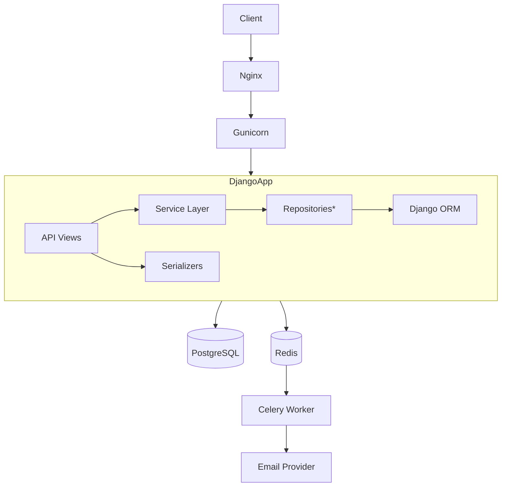

<!--
  NexCart — A backend‑first e‑commerce API built with Django REST Framework.
  Clean Architecture · Service Layer · Repository Pattern (where it matters)
-->

<div align="center">

# 🛒 NexCart

**A production‑oriented, backend‑only e‑commerce REST API**  
*Clean Architecture · Service Layer · Strategic Repository Pattern*

[](https://python.org)
[](https://djangoproject.com)
[](https://www.django-rest-framework.org)
[](https://postgresql.org)
[](https://docker.com)
[](https://github.com/your-username/nexcart/actions)
[](https://github.com/your-username/nexcart)
[](LICENSE)

</div>

---

## 📑 Table of Contents

- [What is NexCart?](#-what-is-nexcart)
- [Architecture](#-architecture)
- [Project Structure](#-project-structure)
- [Tech Stack](#-tech-stack)
- [Features](#-features)
- [API Documentation](#-api-documentation)
- [Authentication Flow](#-authentication-flow)
- [Getting Started](#-getting-started)
- [Environment Variables](#-environment-variables)
- [Running Tests](#-running-tests)
- [Docker](#-docker)
- [CI/CD](#-cicd)
- [Security](#-security)
- [Design Decisions](#-design-decisions)
- [Project Statistics](#-project-statistics)
- [Roadmap](#-roadmap)
- [Contributing](#-contributing)
- [License](#-license)
- [Author](#-author)

---

## 🧠 What is NexCart?

NexCart is a **backend‑only** e‑commerce API built with Django REST Framework.  
It does **not** include a frontend – it’s designed to serve any client (web, mobile, PWA).

The codebase follows **Clean Architecture** principles: business logic lives in a **service layer**, data access is abstracted through **repositories** (where they add value), and views stay thin. The goal is to demonstrate how a real‑world Django project can be structured with the same discipline you’d expect in a senior backend engineer’s portfolio.

> **Key philosophy:** Framework‑agnostic business logic, testable in isolation, and ready for extension (new payment gateways, notification channels) without touching core domain code.

---

## 🏗 Architecture

The application is split into a main **`apps/`** package containing domain modules, and a **`config/`** package holding Django settings and WSGI/ASGI configuration.



*Repositories are used in core domain apps (`accounts`, `categories`, `brands`, `products`). Feature‑oriented apps like `cart` or `orders` use services that directly interact with models where a full repository layer would add unnecessary indirection.*

**Layer rules:**
- **Views** handle HTTP only (parsing, permissions, response formatting).
- **Services** contain all business rules (checkout, stock management, coupon logic).
- **Repositories** (where present) encapsulate ORM queries, making unit‑testing easier.
- **Models** are pure Django ORM – no business logic.

Payment processing uses a **Strategy Pattern**: `payments/gateways.py` defines a base gateway interface. Currently only `FakeGateway` is implemented, but swapping in Stripe or PayPal requires no changes to the order service.

---

## 📁 Project Structure

Only directories relevant to the source code are shown – `__pycache__` and migration caches are omitted.

```
nexcart/
├── apps/                    # All domain applications
│   ├── accounts/            # User model, JWT auth, roles
│   ├── brands/
│   ├── cart/                # Anonymous & authenticated cart
│   ├── categories/          # Nested categories (MPTT)
│   ├── common/              # Shared utilities, pagination, permissions
│   ├── core/                # Domain constants & base exceptions
│   ├── notifications/       # Celery email tasks & templates
│   ├── orders/              # Order lifecycle & checkout
│   ├── payments/            # Gateway abstraction (Strategy)
│   ├── products/            # Products, inventory, discounts
│   ├── reviews/             # Ratings & comments
│   ├── templates/           # Django app for shared templates
│   └── wishlist/
├── config/                  # Django settings, WSGI/ASGI, Celery app
│   ├── settings/
│   │   ├── base.py
│   │   ├── development.py
│   │   └── production.py
│   └── ...
├── requirements/            # Split dependency files
│   ├── base.txt
│   ├── dev.txt
│   └── prod.txt
├── compose/                 # Nginx & other compose‑specific configs
│   └── nginx/
│       └── nginx.conf
├── tests/                   # Global test utilities (factories)
│   └── factories.py
├── .github/workflows/       # CI pipeline
├── Dockerfile
├── Dockerfile.dev
├── docker-compose.yml
├── pyproject.toml           # Black, Ruff, isort config
├── manage.py
└── README.md
```

---

## 🧰 Tech Stack

| Category               | Technology                                         |
|------------------------|----------------------------------------------------|
| **Language**           | Python 3.13                                        |
| **Web Framework**      | Django 5.0, Django REST Framework 3.15             |
| **Database**           | PostgreSQL 16 (production) / SQLite (development)  |
| **Cache & Broker**     | Redis 7                                            |
| **Task Queue**         | Celery 5.4                                         |
| **Authentication**     | JWT (djangorestframework-simplejwt) with blacklist |
| **API Docs**           | drf‑spectacular (Swagger & ReDoc)                  |
| **Web Server**         | Gunicorn + Nginx                                   |
| **Containerization**   | Docker & Docker Compose                            |
| **Code Quality**       | Black, Ruff, isort, pre‑commit                     |
| **Testing**            | Pytest, pytest-cov                                 |
| **CI/CD**              | GitHub Actions                                     |

---

## ✨ Features

### 🔐 Auth & Users
- Custom user model (email as identifier)
- JWT access + refresh tokens, logout with token blacklist
- Email verification, password reset & change
- Roles: Admin, Staff, Customer – enforced via DRF permissions

### 🛍️ Product Catalog
- Nested categories (unlimited depth via MPTT)
- Brands and products with SKU, slug, images
- Inventory tracking
- Discounts with effective price calculation
- Filtering, ordering, and pagination on list endpoints

### ⭐ Reviews & Ratings
- 1‑5 star ratings, review text
- Staff moderation
- Auto‑computed average rating per product

### ❤️ Wishlist
- Add/remove products (authenticated users only)

### 🛒 Shopping Cart
- **Anonymous cart** (session‑based)
- **Authenticated cart** (database)
- Merge on login – guest items transfer to user cart
- Coupon codes with validation
- Automatic price calculation (tax‑ready structure)

### 📦 Orders & Checkout
- Atomic checkout (prevents overselling)
- Order items & address snapshots for historical accuracy
- Stock decrement on successful payment
- Status lifecycle: `pending → confirmed → shipped → delivered → cancelled`

### 💳 Payments
- **Strategy Pattern** gateway abstraction
- Current: `FakeGateway` (simulates success/failure)
- Designed for plug‑and‑play real gateways: Stripe, ZarinPal, PayPal

### 📧 Notifications (via Celery)
- Welcome email
- Email verification
- Password reset
- Order confirmation

---

## 🌐 API Documentation

Once the server is running, interactive docs are available:

| Endpoint         | Description            |
|------------------|------------------------|
| `/api/docs/`     | Swagger UI             |
| `/api/redoc/`    | ReDoc                  |
| `/api/schema/`   | OpenAPI 3 schema (JSON)|

All endpoints are versioned under `/api/v1/`.

---

## 🔐 Authentication Flow

1. Register → email verification task dispatched.
2. Verify email → account activated.
3. Login → receive `access` and `refresh` tokens.
4. Pass `Authorization: Bearer <access>` on protected endpoints.
5. Refresh access token via `/auth/token/refresh/`.
6. Logout → refresh token blacklisted.

Tokens are returned in the response body, giving frontends full flexibility (HTTP‑only cookies or local storage).

---

## 🚀 Getting Started

### Prerequisites
- Python 3.13+
- PostgreSQL (or SQLite for development)
- Redis (optional for local dev if you skip Celery)
- Docker & Docker Compose (optional)

### Local Development (without Docker)

```bash
# Clone repository
git clone https://github.com/your-username/nexcart.git
cd nexcart

# Virtual environment
python3.13 -m venv venv
source venv/bin/activate

# Install dev dependencies
pip install -r requirements/dev.txt

# Environment variables
cp .env.example .env  # edit if needed

# Run migrations
python manage.py migrate

# Create superuser
python manage.py createsuperuser

# Start server
python manage.py runserver
```

To run Celery locally (optional):

```bash
celery -A config worker -l info
```

---

## 🔧 Environment Variables

| Variable               | Description                      | Default / Example                |
|------------------------|----------------------------------|----------------------------------|
| `SECRET_KEY`           | Django secret key                | `change-me-in-production`        |
| `DEBUG`                | Debug mode                       | `True` (dev)                     |
| `ALLOWED_HOSTS`        | Comma‑separated hosts            | `localhost,127.0.0.1`            |
| `DATABASE_URL`         | Database URL (dj‑database‑url)   | `sqlite:///db.sqlite3`           |
| `REDIS_URL`            | Redis connection URL             | `redis://localhost:6379/0`       |
| `EMAIL_*`              | SMTP settings                    | See `.env.example`               |
| `CORS_ALLOWED_ORIGINS` | Allowed CORS origins             | `http://localhost:3000`          |

---

## 🧪 Running Tests

```bash
# All tests with coverage
pytest --cov=apps --cov-report=term-missing

# Specific app
pytest apps/accounts/tests/
```

- **67 tests**
- **81% code coverage**

Factory helpers in `tests/factories.py` simplify test data creation.

---

## 🐳 Docker

A production‑oriented stack is defined in `docker-compose.yml`:

- **web**: Django + Gunicorn
- **nginx**: reverse proxy
- **db**: PostgreSQL
- **redis**: message broker
- **celery**: background worker

```bash
docker-compose up --build -d
docker-compose exec web python manage.py migrate
docker-compose exec web python manage.py createsuperuser
```

For development with hot‑reload, use `Dockerfile.dev` and override the compose file accordingly.

---

## 🔄 CI/CD

GitHub Actions (`.github/workflows/ci.yml`) runs on every push/PR:

- Linting & formatting (Ruff, Black, isort)
- Tests with coverage report
- (Optional) Docker build check

---

## 🔒 Security

- JWT with short‑lived access tokens and refresh rotation
- Token blacklist on logout
- Role‑based access control (Admin/Staff/Customer)
- CSRF protection (for session fallback)
- CORS whitelisting
- HSTS ready (via `SECURE_SSL_REDIRECT` and `SECURE_HSTS_*` settings)
- Secure cookie flags in production
- All secrets via environment variables
- Atomic transactions during checkout

> **Note:** Rate limiting and external monitoring are on the roadmap but not yet implemented.

---

## 🧠 Design Decisions

| Pattern / Practice            | Where & Why                                                                 |
|-------------------------------|-----------------------------------------------------------------------------|
| **Service Layer**             | Used everywhere. All business logic (checkout, cart merge, discount calc) sits in `services.py`. |
| **Repository Pattern**        | Applied in core data‑heavy apps (`accounts`, `brands`, `categories`, `products`). Avoided in transactional apps (`cart`, `orders`) to prevent over‑engineering. |
| **Strategy Pattern**          | Payment gateways – `FakeGateway` implements the interface; swapping is trivial. |
| **Atomic Transactions**       | Checkout uses `transaction.atomic()` to prevent race conditions. |
| **Split Settings**            | `config/settings/base.py`, `development.py`, `production.py` – clean separation without third‑party packages. |
| **Split Requirements**        | `base.txt`, `dev.txt`, `prod.txt` – keeps production images lean. |

---

## 📊 Project Statistics

| Metric             | Value                          |
|--------------------|--------------------------------|
| Tests              | 67                             |
| Coverage           | 81%                            |
| Architecture       | Clean / Layered                |
| Service Layer      | ✅ All apps                     |
| Repository Pattern | ✅ Core domains                 |
| Docker Ready       | ✅                              |
| CI/CD              | ✅ GitHub Actions               |

---

## 🗺 Roadmap

- [ ] **Real payment gateways**: Stripe, ZarinPal, PayPal
- [ ] **Rate limiting** on auth endpoints
- [ ] **GraphQL** endpoint (Strawberry)
- [ ] **Product variants** (e.g., size, color)
- [ ] **Shipping cost integration**
- [ ] **Improved admin panel** (headless)
- [ ] **Full‑text search** (PostgreSQL `SearchVector`)

---

## 🤝 Contributing

Contributions that respect the architecture are welcome.

1. Fork the repo
2. Create a feature branch
3. Install pre‑commit hooks (`pre-commit install`)
4. Write tests for your changes
5. Ensure all tests pass and coverage does not drop
6. Submit a PR

Code style is enforced automatically by Black, Ruff, and isort.

---

## 📄 License

MIT – see [LICENSE](LICENSE).

---

## 👤 Author

Amir Ali Pourbabaeii – Backend Developer
[GitHub](https://github.com/ByteBite1391)

---

<div align="center">
  <sub>Built with clean architecture, tested thoroughly, and documented honestly.</sub>
</div>